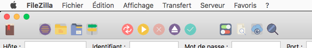

# Essential theme
##### Material icons theme for Filezilla

### How to install
**Windows**
- I have no idea

**macOS**
- Go to your Applications folder
- Right clic on FileZilla & select "Show package content".
- Go into Contents / SharedSupport / resources
- Drop the theme folder here (and rename if if you want)
- Restart FileZilla
- Go in FileZilla settings & select the theme

Note that any FileZilla update removes this folder, so you'll have to do that again each time #PIA

  
**DISCLAIMER** : I'm not the designer of those icons, i took them from the [Essential collection](http://www.flaticon.com/packs/essential-collection) on [Flaticon.com](http://www.flaticon.com). Their license is free for commercial use with attribution. Please respect that too.

Default Filezilla icons looks like sh** so i did this theme for me. Since i enjoy it, i share it.
